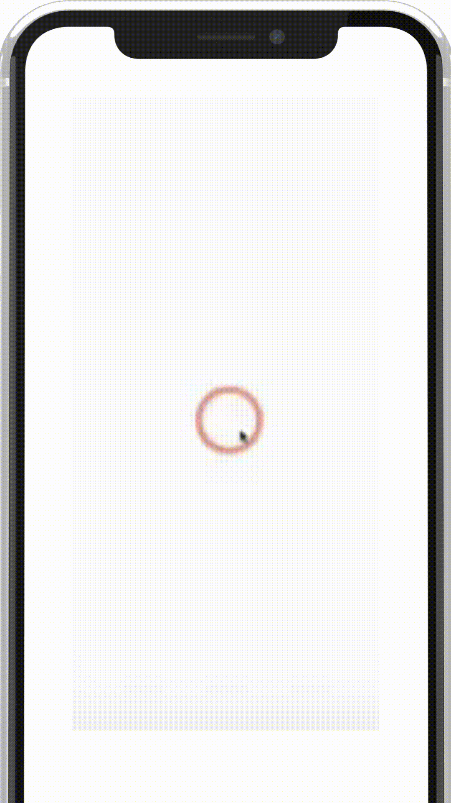

# react-native-animation-ring

This Ring Animation is react-native and expo in use.

### Get Started 

This Blow Code is Give Vanilla Code to No Any Additional Changes.

```javascript

import React from 'react';
import {RingAnimation} from 'react-native-animation-ring';

const RingAnimation = ()=>{

return (

<RingAnimation 
     height='20' 
     width='20'
     
/>

);
};

export default RingAnimation;

```

## Other

Under The give to Ring Animation Code in Ring Delay and Duration Animation Time to change in execution Time.

```javascript

import React from 'react';

import {RingAnimation} from 'react-native-animation-ring';

const RingAnimation = ()=>{

useEffect(() => {
    ring.value= withDelay(
      delay,
      withRepeat(
        withTiming(1,{
          duration:4000,      // 'change this Animation Duration Time as per Requirement'.
        }),
        -1
      )
    );
  },[]);


return (

 <View style={styles.container}>
      <RingAnimation delay={0}/>                 //  change this 
      <RingAnimation delay={1000}/>              //    Delay method in
      <RingAnimation delay={2000}/>              //    Time change to
      <RingAnimation delay={3000}/>              //  more or less yours choice
    </View>

);

};

 const styles = StyleSheet.create({
  container: {
    flex: 1,
    justifyContent: 'center',
    alignItems: 'center',
  },
 });

export default RingAnimation;

```

## Demo Video



### Ring Props

| parameter  | type   |  description |
| :--------  | :----  |  :---------- |
| delay      | number |  Specifies the delay in milliseconds before the ring animation starts. This prop allows you to stagger the start times of multiple RingAnimation components, creating a ripple effect.|